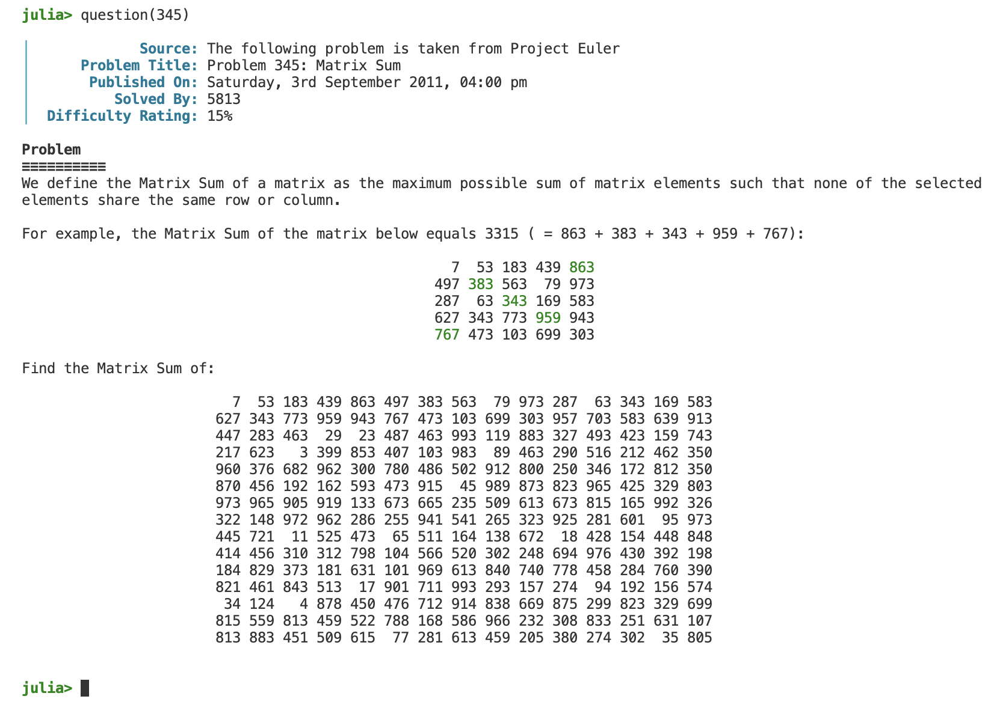

<div align="center">
    <br><br>
    <a href="https://img.shields.io/github/repo-size/udohjeremiah/ProjectEuler.jl">
        
    </a>
    <a href="https://github.com/udohjeremiah/ProjectEuler.jl/actions/workflows/CI.yml">
        
    </a>
    <a href="https://codecov.io/gh/udohjeremiah/ProjectEuler.jl/branch/main">
        
    </a>
    <a href="https://juliahub.com/ui/Packages/ProjectEuler/8lUJP">
        
    </a>
    <a href="https://github.com/udohjeremiah/Git-Plus-Hub-Flow">
        
    </a>
    <a href="https://github.com/SciML/ColPrac">
        
    </a>
    <br><br>
</div>

# Installing
To install and use, follow these steps:

```julia
julia> ] # enters the package mode
pkg> add ProjectEuler

julia> using ProjectEuler
```

# Usage
Currently, this package provides only one function: `question`. However, there are plans to
support two more important ones, as indicated [here](https://github.com/udohjeremiah/ProjectEuler.jl/blob/3272257a9046cdf153593690457793233e9ef2c6/src/problemutils.jl#L54C1-L58).

## question
The `question` function takes only one argument, an `Integer` value, and then it returns
a struct of type `Problem`. The `content` field of the returned `Problem` struct is edited to
render it as identical as possible to its appearance on https://projecteuler.net. An example
is shown below:

<div align="center">
    <br><br>
</div>

Some problems have not been edited yet because they require an image or a complex
mathematical equation (which, unfortunately, Julia's REPL cannot render at present).
Therefore, passing certain values to `question` will result in an error.

## Screen Size
To fully experience all the questions, you may need to increase the width of your terminal
screen to a value equal to or greater than 115. You can do this by dragging either the left
or right end of your terminal.

You can use the function `displaysize` to view the lines (height) and columns (width) of
your terminal screen. The returned tuple represents the lines and columns of your terminal
screen, respectively:

```julia
julia> displaysize(stdout)
(37, 115)
```

# Contributing
We welcome contributions to this package! Users are encouraged to contribute by implementing
new features and identifying/fixing bugs through pull requests (PRs) on this GitHub
repository.

Currently, there are many unedited problems in the [unedited_questions.txt](https://github.com/udohjeremiah/ProjectEuler.jl/blob/main/src/unedited_questions.txt)
file. We invite users with artistic skills in the REPL to take a look at these problems and
see how they can render them in the Julia REPL to look exactly as they do on
https://projecteuler.net.

When contributing, please ensure that your code adheres to the workflow and coding standards
used in this package and that it is thoroughly tested. We also ask that you provide clear
and concise documentation, including examples of how to use the new features.

Thank you for considering contributing to this package, and we look forward to your
contributions!
